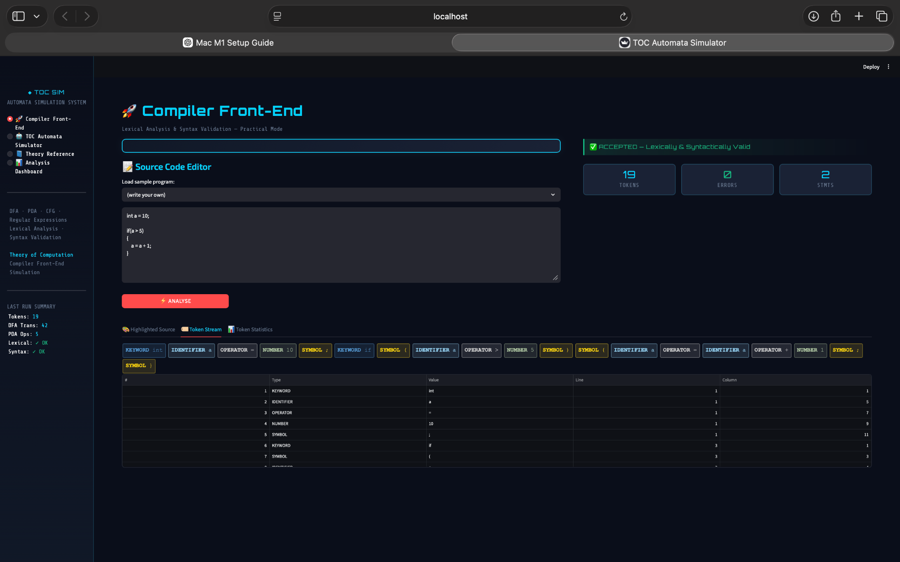
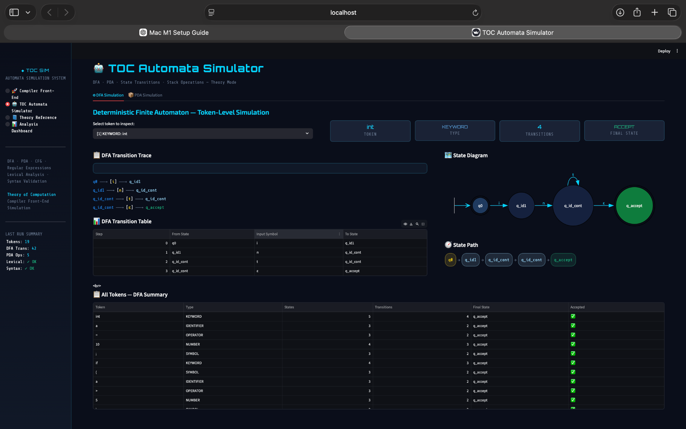
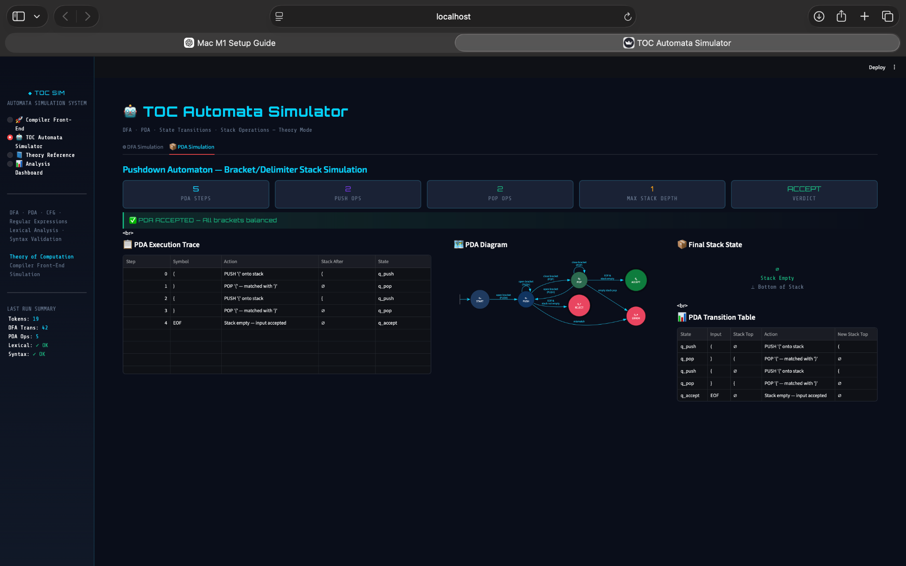

# 🚀 Compiler Front-End Automata Simulation System

> Interactive Theory of Computation (TOC) project demonstrating how Deterministic Finite Automata (DFA) and Pushdown Automata (PDA) power modern compiler front-end systems.

---

# 📌 Overview

The **Compiler Front-End Automata Simulation System** is an interactive educational and visualization platform that bridges the gap between abstract **Theory of Computation (TOC)** concepts and practical **compiler design**.

The project simulates the core stages of a compiler front-end using:

- 🔍 **Deterministic Finite Automata (DFA)** for lexical analysis
- 📚 **Pushdown Automata (PDA)** for syntax validation
- 🧠 **Context-Free Grammar (CFG)** concepts for structural analysis
- 📊 Interactive automata visualizations using **Graphviz**
- 🌐 Modern UI built with **Streamlit**

The simulator allows users to input C-style source code and observe:

- Token generation
- DFA state transitions
- PDA stack operations
- Syntax validation
- Error reporting
- Compiler workflow visualization

---

# ✨ Features

- 🔍 DFA-based lexical analyzer
- 📚 PDA-based syntax validator
- 🧠 CFG-based structural validation concepts
- 📄 Real-time token stream generation
- 📊 DFA state transition visualization
- 📦 PDA stack simulation
- ❌ Lexical & syntax error reporting
- 🌐 Interactive Streamlit interface
- 🎨 Modern dark-themed UI
- 📖 TOC theory reference section
- 🧪 Educational compiler simulation environment

---

# 🖼️ Project Preview

## 🔹 Main Compiler Front-End Interface



---

## 🔹 DFA-Based Lexical Analysis Simulation



---

## 🔹 PDA-Based Syntax Validation Simulation



---

# 🏗️ System Architecture

The system follows a modular compiler front-end workflow:

```text
Source Code
     ↓
Lexical Analyzer (DFA)
     ↓
Token Stream
     ↓
Syntax Validator (PDA / CFG)
     ↓
Validated Structure
     ↓
Validated Source Code
```

Error Flow:

```text
Lex Error   ──► Error Reporter
Syntax Error ─► Error Reporter
```

---

# 🖼️ Project Screenshots

## 🔹 Main Compiler Front-End Interface

Shows source code analysis, token generation, and validation status.


---

## 🔹 DFA-Based Lexical Analysis

Visual representation of DFA transitions during token recognition.


---

## 🔹 PDA-Based Syntax Validation

Demonstrates stack operations and syntax validation using PDA concepts.


---

## 🔹 Theory Reference Module

Interactive explanation of DFA, PDA, CFG, and compiler concepts.


---

# ⚙️ Technologies Used

- Python
- Streamlit
- Graphviz
- HTML / CSS
- Theory of Computation
- Compiler Design Concepts

---

# 🧠 Core TOC Concepts Implemented

| Concept | Usage |
|---|---|
| DFA | Lexical Analysis |
| PDA | Syntax Validation |
| CFG | Structural Grammar Concepts |
| Regular Expressions | Token Recognition |
| Stack Operations | Nested Structure Validation |
| State Transitions | Automata Simulation |

---

# 🔍 Lexical Analysis using DFA

The lexical analyzer processes source code character-by-character and recognizes:

- Keywords
- Identifiers
- Operators
- Numbers
- Symbols
- Literals

Formal DFA transition function:

```math
δ : Q × Σ → Q
```

---

# 📚 Syntax Validation using PDA

The syntax validator uses a stack-based Pushdown Automata mechanism to validate:

- Balanced brackets
- Nested scopes
- Structural syntax patterns

Stack operations:

- PUSH → opening delimiters
- POP → closing delimiters

---

# 🚀 Getting Started

## 1️⃣ Clone the Repository

```bash
git clone https://github.com/your-username/compiler-front-end-automata-simulator.git
cd compiler-front-end-automata-simulator
```

---

## 2️⃣ Create Virtual Environment

### macOS / Linux

```bash
python3 -m venv venv
source venv/bin/activate
```

### Windows

```bash
python -m venv venv
venv\Scripts\activate
```

---

## 3️⃣ Install Dependencies

```bash
pip install -r requirements.txt
```

---

## 4️⃣ Run the Application

```bash
streamlit run app.py
```

---

# 📂 Project Structure

```text
compiler-front-end-automata-simulator/
│
├── app.py
├── lexer/
├── parser/
├── automata/
├── visualizer/
├── assets/
├── requirements.txt
└── README.md
```

---

# 🎯 Learning Outcomes

This project demonstrates:

- Practical implementation of TOC concepts
- DFA-based lexical scanning
- PDA-based syntax validation
- Compiler front-end workflow
- Automata visualization techniques
- Relationship between formal languages and compilers

---

# 📈 Future Improvements

- 🌳 Parse Tree Generation
- 🧠 Abstract Syntax Tree (AST)
- ⚡ LL/LR Parser Integration
- 🌐 Multi-language support
- 🎞️ Animated automata execution
- 📊 Advanced compiler analytics

---

# 👨‍💻 Author

**Srishti S Sindgi**  

